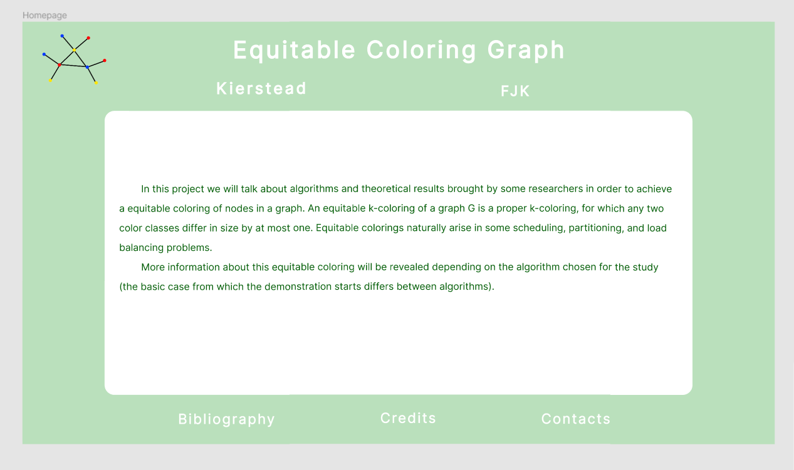

# Figma prezentation
<!DOCTYPE html>
<html lang="en">
<head>
    <meta charset="UTF-8">
    <meta http-equiv="X-UA-Compatible" content="IE=edge">
    <meta name="viewport" content="width=device-width, initial-scale=1.0">
</head>
<body>
    <header>
        <h1>Equitable-coloring</h1>
        <dl>
            <dt>Author</dt>
            <dd><a href="https://github.com/TudosaEduard">Tudosa Eduard-Bogdan</a> 3A5 </dd>
            <dt>Coordinator</dt>
            <dd><a href="https://profs.info.uaic.ro/~busaco/teach">Sabin Corneliu Buraga</a></dd>
            <dt>Faculty of Computer Science Iasi</dt>
            <dt>Human-Computing Interaction Course</dt>
                </dl>
    

        <ol role="directory">
            <li><a href="#1-abstract">Abstract</a> </li>
            <li><a href="#2-introduction">Introduction</a> </li>
            <li><a href="#3-user-interface">User Interface</a>
            </li>
            <li><a href="#4-qoc">QOC</a>
            </li>
            <li><a href="#5-personas">Personas</a>
            </li>
            <li><a href="#6-observations">Observations</a>
            </li>
            <li><a href="#7-conclusion">Conclusion</a>
            </li>
            <li><a href="#8-feedback">Feedback</a>
        </ol>
    

    <section id="abstract" role="doc-abstract">
        <h2>1. Abstract</h2>
        
Consider as a HCI project the software application to be developed in order to achieve your BSc (Bachelor of Science) title. The project requires to envision and design an interactive solution based on the existing HCI principles, methods, and best practices – for details & useful resources, study the HCI discipline film.  It is desirable that the icons, images, and other multimedia content of the user interface to be original.  Open source approaches and proposals from the enrolled students are highly encouraged.  The code-source and specific content (data) must be available under the terms of the open source licenses and/or Creative Commons.  The proposed solution will be an interface made in the figma application that will be as a support for the presentation of the license.

    </section>
    <section id="introduction" role="doc-introduction">
        <h2>2. Introduction</h2>
        
This project made in the figma application represents an interactive presentation of the theoretical part on which my license is based (polynomial algorithms that solve a difficult problem of fair coloring of nodes).  In short, this equitable coloring of nodes represents the division of a graph into coloring classes, where the cardinals of these classes differ from each other by at most one node.  This coloring will be studied through the prism of 2 polynomial algorithms (one recursive and one greedy), and for them will be brought to the presentation things related to various important notations, demonstrations that led to solving the problem and a pseudocode related to the code realized.

    </section>
    <section id="user-interface" role="doc-structure">
        <h2>3. User-Interface</h2>
        
The interface that I made, as I said before, was made in this application called figma, an application that is easy to use, easy to learn and has many interesting tools. One of these tools that I used was a plugin for math symbols called LaTeX Complete.  
        A first step in creating the interface was to plan / sketch the main page, as well as some standard elements that will appear on any page (title, logo).
Here is a first sketch of the main page:   

        
        
  The design is simple, with few elements, a few buttons with certain functionalities, the sketch being easy to materialize in the first prototype made:   

        
        
  Next we went on to the actual realization of the pages of the algorithms we want to present. Here I had to think about the most essential things of interest for these algorithms. Thus we arrived at the following sketch:   

        
        
  Thus with this sketch we were able to make in the figma the pages for the 2 algorithms, where we wanted to touch in general the special notations that the algorithm presents, the demonstration of the algorithm, as well as that pseudocode referring to the code. A prototype made for this sketch is the following (later I will add the code part):   

        
        
  The demonstration and the code are not yet complete, therefore a final sketch and prototypes made after this will come on the side of special notations of the algorithm in question.   

        
    </section>
    <section id="qoc" role="doc-structure">
        <h2>4. QOC</h2>
        

    </section id="personas" role="doc-structure">
        <h2>5. Personas</h2>
        

    </section>
    </section id="observations" role="doc-structure">
        <h2>6. Observations</h2>
        

    </section>
    </section id="conclusion" role="doc-structure">
        <h2>7. Conclusion</h2>
        

    </section>
    </section id="feedback" role="doc-structure">
        <h2>8. Feedback</h2>
        

    </section>
    </header>
</body>
</html>
